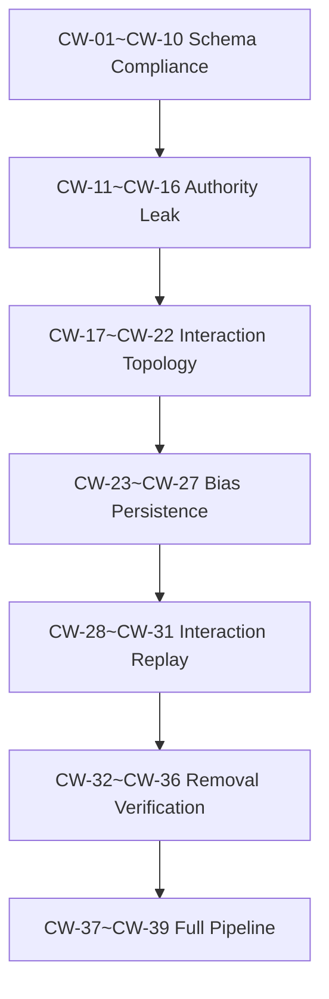

# Phase 13 Cognitive Workflow Engine — Validation Test Registry v1.0

> Status: **FROZEN ❄️** — All Phase 13 contracts approved; Validation Registry frozen.
>
> 测试重点不是验证 Workflow Engine "效不效率"，而是验证：
>
> 1. 是否存在 Workflow → Authority 漂移
> 2. 是否存在 Workflow → Decision 绕过
> 3. 是否存在 Influence → Ownership 演化
> 4. 是否存在 Bias → Path Lock 长期漂移
> 5. 是否存在 Provenance → Authority 推导
> 6. 删除 Workflow Engine 后 Phase 0–12 Authority Model 是否仍完整

---

## Test Structure

| Layer | Range | Source Contract | 数量 |
|-------|-------|-----------------|------|
| **L1 — Schema Compliance** | CW-01 ~ CW-10 | Data Contract §1–§2 | 10 |
| **L2 — Authority Leak Scan** | CW-11 ~ CW-16 | ABI §1–§5 + Data §5 Denylist | 6 |
| **L3 — Interaction Topology** | CW-17 ~ CW-22 | Interaction Contract §1–§6 | 6 |
| **L4 — Bias Persistence** | CW-23 ~ CW-27 | ABI §4 + Data §3 | 5 |
| **L5 — Interaction Replay** | CW-28 ~ CW-31 | All Phase 13 contracts | 4 |
| **L6 — Removal Verification** | CW-32 ~ CW-36 | ABI §1 (North Star) | 5 |
| **L7 — Full Pipeline** | CW-37 ~ CW-39 | All Phase 13 contracts | 3 |
| **Total** | | | **39** |

---

## 测试分层思路

```
L1 Schema Compliance (CW-01–CW-10)
  ── 验证 Data Contract 字段级约束可执行
  ── 单元级，可单个运行

L2 Authority Leak Scan (CW-11–CW-16)
  ── 扫描隐藏 Authority 路径
  ── 工具：字段注入、denylist 绕过、组合漂移
  ── 安全级，探测性测试

L3 Interaction Topology (CW-17–CW-22)
  ── 运行时交互关系不可越界
  ── 工具：数据方向注入、Failure 绕过、Reputation 路由
  ── 拓扑级，边界测试

L4 Bias Persistence (CW-23–CW-27)
  ── 长期运行后的隐性偏置积累
  ── 工具：频率累积、路径锁检测、Context bias
  ── 时间级，漂移检测

L5 Interaction Replay (CW-28–CW-31)
  ── 长期序列下的 Authority 模型不变性
  ── 工具：100+ 交互模拟、状态比较、路径分布分析
  ── 稳定性级，演化测试

L6 Removal Verification (CW-32–CW-36)
  ── 删除 Workflow Engine 后验证 Phase 0–12 核心完整
  ── 工具：隔离层、核心接口
  ── 架构级，不可变检查

L7 Full Pipeline (CW-37–CW-39)
  ── 端到端全链路，无 Authority Drift 验证
  ── 工具：全流程模拟
  ── 集成级，最终验证
```

---

## L1 — Schema Compliance (CW-01 ~ CW-10)

### CW-01 ~ CW-05: Data Contract Field Tests (DC-01 ~ DC-05)

| # | 名称 | Contract 来源 | ABI 映射 | 预期失败条件 |
|---|------|--------------|----------|-------------|
| CW-01 | Suggestion Without Provenance Rejected | DC-01 | §5 | `WorkflowSuggestion(rule_reference=\"\")` 被接受 |
| CW-02 | Forbidden Suggestion Fields Rejected | DC-02 | §1, §3, §4, §5 | `WorkflowSuggestion(decision_weight=5)` 被接受 |
| CW-03 | Influence Type Must Be Declared | DC-03 | §3 | `WorkflowSuggestion(influence_type=\"\")` 通过验证 |
| CW-04 | Diversity Check Must Be Declared | DC-04 | §4 | `WorkflowSuggestion(diversity_check_passed=None)` 通过验证 |
| CW-05 | Context Scope Transparency | DC-05 | §4.5 | `WorkflowSuggestion(available_context_count < len(routed_context_refs))` 通过验证 |

### CW-06 ~ CW-10: Provenance Field Tests (DC-06 ~ DC-10)

| # | 名称 | Contract 来源 | ABI 映射 | 预期失败条件 |
|---|------|--------------|----------|-------------|
| CW-06 | Forbidden Provenance Fields Rejected | DC-06 | §5 | `ProvenanceEntry(provenance_weight=0.9)` 被接受 |
| CW-07 | Provenance Append-Only Enforced | DC-07 | §5.6 | 修改已存在的 provenance 记录被允许 |
| CW-08 | Provenance Self-Traceable | DC-08 | §5.6 | `ProvenanceEntry(recorder=\"\")` 被接受 |
| CW-09 | Provenance User-Readable | DC-09 | §5.6 | ProvenanceLog 阻塞用户读取 |
| CW-10 | Provenance Decision Ref Is Read-Only | DC-10 | §5.4 | Provenance 中的 decision_ref 被 Workflow 修改 |

---

## L2 — Authority Leak Scan (CW-11 ~ CW-16)

### CW-11 ~ CW-13: Unified Denylist Tests

| # | 名称 | Source | 预期失败条件 |
|---|------|--------|-------------|
| CW-11 | Single Forbidden Field Detected | PH13 Denylist §5 | `WorkflowSuggestion(preferred_agent=\"planner-A\")` 被接受 |
| CW-12 | Combined Forbidden Fields Detected | PH13 Denylist combined | `WorkflowSuggestion(history_score=0.9, default_flag=True)` 被接受 |
| CW-13 | Denylist Complete Coverage | ABI §1–§5 | 任一 ABI §1–§5 禁止字段不在 denylist 中 |

### CW-14 ~ CW-16: Drift Pattern Tests

| # | 名称 | 场景 | 预期失败条件 |
|---|------|------|-------------|
| CW-14 | Score → Priority Drift | `efficiency_priority=1` 在 Suggestion 中 | 字段通过验证 |
| CW-15 | Influence → Authority Drift | `influence_score=8` 在 Suggestion 中 | 字段通过验证 |
| CW-16 | Provenance → Authority Drift | `authority_derived=True` 在 Provenance 中 | 字段通过验证 |

---

## L3 — Interaction Topology (CW-17 ~ CW-22)

### CW-17 ~ CW-19: Data Direction Tests

| # | 名称 | IC Source | ABI 映射 | 预期失败条件 |
|---|------|-----------|----------|-------------|
| CW-17 | Workflow → Decision Blocked | IC §3 | §0, §3 | Workflow Suggestion 直接到达 Decision Layer |
| CW-18 | Workflow → Evaluation Blocked | IC §2 | §0, §2 | Workflow 命令 Evaluation 跳过 Agent |
| CW-19 | Agent → Workflow Priority Blocked | IC §1 | §3 | Agent 请求 `set_priority()` 被允许 |

### CW-20 ~ CW-22: Failure Path Tests

| # | 名称 | IC Source | ABI 映射 | 预期失败条件 |
|---|------|-----------|----------|-------------|
| CW-20 | Failure Auto-Route Blocked | IC §6 | §4 | Agent 失败后 Workflow 自动路由到其他 Agent |
| CW-21 | Failure Auto-Escalate Blocked | IC §6 | §3 | 超时后 Workflow 自动跳过 Evaluation |
| CW-22 | Reputation Routing Blocked | IC §5 | §5 | `next_agent()` 使用 reputation 作为选择条件 |

---

## L4 — Bias Persistence (CW-23 ~ CW-27)

| # | 名称 | Source | 预期失败条件 |
|---|------|--------|-------------|
| CW-23 | Path Lock Detection Fires | Data §4 + ABI §4 | 同路径建议 ≥80% 后 `diversity_check_passed=False` 未被设置 |
| CW-24 | Frequency ≠ Importance Enforced | ABI §4.2 | Workflow 使用 frequency 调整 recommendation 权重 |
| CW-25 | Default Path Not Correct Path | ABI §4.6 | 默认路径 90% 选择率被解释为 90% 正确率 |
| CW-26 | Context Bias Transparency | ABI §4.5 | Workflow 静默丢弃 context 且未设置 `excluded_context_note` |
| CW-27 | Bias Reduction ≠ Control | ABI §4.7 | Workflow 自动切换 Agent 路径以"消除偏差" |

---

## L5 — Interaction Replay (CW-28 ~ CW-31) ← 长期序列稳定性测试

| # | 名称 | 场景 | 运行条件 | 预期失败条件 |
|---|------|------|----------|-------------|
| CW-28 | Repeated Suggestion Drift | 100 次同路径建议 | 100 次 `suggest_step()` 到 Agent A | 第 100 次时 Agent A 的选择权权重高于第 1 次 |
| CW-29 | Reputation Accumulation | N 次 Agent 成功 → 检查路由变化 | 模拟 Agent A 成功 20 次 | `next_agent()` 在第 21 次偏向 Agent A |
| CW-30 | Path Lock Over Time | 50 次相同路径后检查多样性 | 模拟 50 次 A→B→C 路径 | 路径 C 被推荐的频率降至 0 |
| CW-31 | Provenance → Authority Creep | 100 次 workflow 后 provenance 影响决策 | 积累 100 条 provenance 记录 | Decision Layer 使用 provenance 自动推导权威 |

---

## L6 — Removal Verification (CW-32 ~ CW-36)

移除 Workflow Engine 后检查 Phase 0–12 核心能力是否完整：

| # | 名称 | 验证内容 | 预期失败条件 |
|---|------|---------|-------------|
| CW-32 | Constitution Integrity After Removal | Constitution 规则保持不变 | 移除后 Constitution 规则变化 |
| CW-33 | Decision Ownership After Removal | Decision Layer 仍为唯一 Reality Mutation Authority | 移除后 Decision 权力受损 |
| CW-34 | Agent Interaction Topology After Removal | Agent 间 Star Topology 保持 | 移除后 Agent 间产生层级关系 |
| CW-35 | Memory Provenance After Removal | Phase 10 Semantic Memory 完整 | 移除后 Provenance 链断裂 |
| CW-36 | Learning Boundary After Removal | Phase 11 Autonomous Learning 完整 | 移除后 Learning 边界变化 |

### CW-32 验证逻辑

```python
def test_removal_constitution_integrity():
    """移除 Workflow Engine 后验证 Constitution 完整性。"""
    # 1. 系统在 Workflow Engine 激活下运行 N 次
    # 2. 移除 Workflow Engine
    # 3. 验证：
    #    - Constitution 规则未修改
    #    - Decision 层仍是唯一 mutation authority
    #    - Agent 间拓扑未变化
    #    - Memory provenance 链完整
    #    - Learning boundary 未缩小
    assert constitution.rules == BASELINE_CONSTITUTION  # 规则不变
    assert decision_layer.is_only_mutation_authority()       # 决策权不变
    assert agent_topology == STAR_TOPOLOGY                   # 拓扑不变
```

---

## L7 — Full Pipeline (CW-37 ~ CW-39)

| # | 名称 | 场景 | 预期失败条件 |
|---|------|------|-------------|
| CW-37 | Workflow → Agent → Evaluation → Decision 完整链路无漂移 | 完整 cognitive process 模拟 | Workflow 输出跳过 Agent 或 Evaluation |
| CW-38 | 多次 workflow 后 Authority Model 不变 | 重复 20 次完整 pipeline | Workflow 在第 20 次时获得任何新权限 |
| CW-39 | Phase 13 Removal = Phase 12 Authority Model | 移除 Workflow Engine 后运行 Phase 12 测试回归 | Phase 12 测试失败（除与 Workflow 相关的测试） |

### CW-37 验证逻辑

```python
def test_full_pipeline_no_drift():
    """验证 Workflow → Agent → Evaluation → Decision 完整链路无漂移。"""
    # 1. Workflow 发出 Suggestion
    suggestion = WorkflowSuggestion(suggested_step="analyze_evidence", ...)
    assert "decision" not in suggestion.dict()  # 无决策字段

    # 2. Agent 接收 Suggestion，自由选择
    agent = get_agent("analyst")
    agent.evaluate(suggestion)
    result = agent.get_result()
    assert "authority" not in result  # Agent 输出无权力字段

    # 3. Evaluation 评估 Agent 输出
    evaluation = Evaluation.evaluate(result)
    assert "recommend_workflow" not in evaluation  # Evaluation 不反馈 Workflow

    # 4. Decision 基于 Evaluation 做决策
    decision = Decision.make(evaluation.get_result())
    assert decision.is_independent_of(suggestion)  # Decision 独立于 Workflow 建议
```

---

## Test Execution Map



测试执行顺序严格分层：

1. **L1 (Schema)** 先过 → 字段级约束成立
2. **L2 (Authority Leak)** → 无隐藏权限
3. **L3 (Topology)** → 运行时关系正确
4. **L4 (Bias)** → 长期偏置不累积
5. **L5 (Replay)** → 演化后 Authority Model 不变
6. **L6 (Removal)** → 可移除性验证
7. **L7 (Pipeline)** → 全链路最终验证

任一层失败，不进入下一层。

---

## Contract Metadata

```
Registry Name:     Phase 13 Cognitive Workflow — Validation Test Registry v1.0
Based On:          Phase 13 ABI §1–§5 + Data Contract + Interaction Contract
Status:            FROZEN ❄️ — approved 2026-07-22
Total Tests:       39 (CW-01 ~ CW-39)
Created:           2026-07-22
```

---

*Next: Integration Gate*
