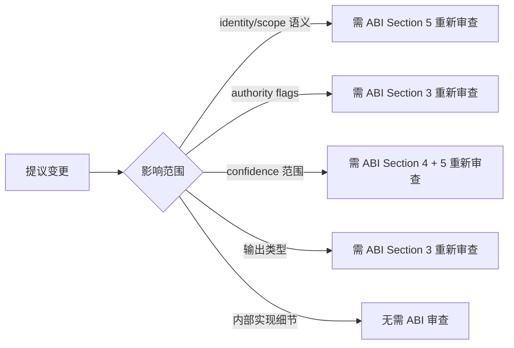

# Experience Data Contract v1.0

> Phase 10 — Experience Intelligence Layer
> ABI anchor: `docs/abi/OCOS-Experience-ABI-1.0.md`
> Status: **FROZEN ✅** — Audit passed. Phase 10 Data Contract.

---

## 1. Experience Object Definition

### 1.1 什么是 Experience

**Experience ≠ Memory Log.** 两者区别：

| Memory Log | Experience |
|-----------|------------|
| 记录事件发生 | 记录事件发生 + 结果评估 + 适用条件 |
| 不可判断可信度 | 携带原始置信度和校准历史 |
| 无范围限定 | 有 scope 描述适用域 |
| 被动存储 | 可被检索、校准、衰减 |
| 没有权威声明 | 显式声明不是 Rule/Decision/Obligation |

### 1.2 Experience 的本质

```
Experience = Observed Event
           + Context Snapshot
           + Outcome Evaluation
           + Confidence (raw + calibrated)
           + Applicability Scope
           + Provenance (source + traceability)
           - Authority (is_rule/is_decision/is_obligation = false)
```

### 1.3 非目标

Experience Data Contract 不涉及：
- 存储引擎选择（SQLite / 文件 / 内存）
- 检索算法（向量相似度 / 标签匹配）
- 校准算法实现细节
- 时序策略（这些属于 Store 和 Calibration Engine 的职责）

---

## 2. ExperienceRecord Schema

### 2.1 完整 Schema

```python
from dataclasses import dataclass, field
from datetime import datetime
from typing import List, Optional

@dataclass(frozen=True)
class ExperienceRecord:
    # ── Identity (immutable after creation) ──
    experience_id: str                              # UUID v4
    created_at: datetime                            # wall-clock time of creation

    # ── Provenance ──
    source_type: str                                # "observation" | "decision" | "simulation" | "user_feedback"
    source_id: str                                  # original event ID for traceability
    source_accuracy: Optional[float] = None         # overall historical accuracy of source [0,1]

    # ── Observation ──
    event_description: str                          # what was observed
    context_snapshot: str                           # environmental state at time of event
    domain: str                                     # high-level domain tag, e.g. "code_review", "creative_writing"

    # ── Outcome ──
    expected_outcome: Optional[str]                 # what was expected (may be null)
    actual_outcome: str                             # "success" | "failure" | "partial" | "unknown"
    outcome_delta: Optional[str]                    # qualitative diff between expected and actual

    # ── Confidence ──
    raw_confidence: float                           # initial confidence at creation [0, 1]
    calibrated_confidence: float                    # current confidence after all calibrations [0, 1]
    confidence_history: List[CalibrationEvent] = field(default_factory=list)

    # ── Applicability ──
    scope: str                                      # structured: "{domain}:{context}:{condition}"
    conditions: List[str] = field(default_factory=list)  # specific conditions, e.g. ["python3.12", "high_load"]
    limitations: List[str] = field(default_factory=list)  # known limitations

    # ── Authority Flags (MANDATORY: always False) ──
    is_rule: bool = False
    is_decision: bool = False
    is_obligation: bool = False
```

```python
@dataclass(frozen=True)
class CalibrationEvent:
    timestamp: datetime
    old_value: float
    new_value: float
    reason: str     # "source_accuracy_update" | "scope_mismatch" | "decay" | "manual"
```

### 2.2 字段约束表

| 字段 | 必需 | 约束 | 修改规则 |
|------|------|------|---------|
| `experience_id` | ✅ | 非空 UUID v4 | 创建后不可变 |
| `created_at` | ✅ | 有效 datetime | 创建后不可变 |
| `source_type` | ✅ | 枚举之一 | 创建后不可变 |
| `source_id` | ✅ | 非空 | 创建后不可变 |
| `event_description` | ✅ | 非空 | 可追加注释 |
| `context_snapshot` | ✅ | 非空 | 可追加（不删除） |
| `domain` | ✅ | 非空 | 创建后不可变 |
| `expected_outcome` | ❌ | — | 可更新 |
| `actual_outcome` | ✅ | 枚举 | 可更新（从 unknown 到已知） |
| `outcome_delta` | ❌ | — | 可更新 |
| `raw_confidence` | ✅ | [0, 1] | 创建后不可变 |
| `calibrated_confidence` | ✅ | [0, 1] | 仅通过 CalibrationEvent 更新 |
| `confidence_history` | ✅ | 不可为空列表 | 仅追加 |
| `scope` | ✅ | 非空匹配 `domain:context:condition` | 创建后不可变 |
| `conditions` | ❌ | — | 仅追加 |
| `limitations` | ❌ | — | 仅追加 |
| `is_rule` | ✅ | 必须为 False | 不可变 |
| `is_decision` | ✅ | 必须为 False | 不可变 |
| `is_obligation` | ✅ | 必须为 False | 不可变 |

### 2.3 序列化契约

```json
{
    "experience_id": "a1b2c3d4-...",
    "created_at": "2026-07-21T14:30:00Z",
    "source_type": "decision",
    "source_id": "decision-20260721-001",
    "source_accuracy": 0.82,
    "event_description": "Generated plot outline for urban romance chapter 3",
    "context_snapshot": "user_mood=productive, stage=outlining, genre=urban_romance",
    "domain": "creative_writing",
    "expected_outcome": "high_user_satisfaction",
    "actual_outcome": "success",
    "outcome_delta": "exceeded expectation",
    "raw_confidence": 0.85,
    "calibrated_confidence": 0.75,
    "confidence_history": [
        {"timestamp": "2026-07-21T14:30:05Z", "old_value": 0.85, "new_value": 0.75, "reason": "source_accuracy_update"}
    ],
    "scope": "creative_writing:urban_romance:outlining",
    "conditions": ["chapter_3", "modern_setting"],
    "limitations": ["n=1 single chapter", "source_accuracy=0.82"],
    "is_rule": false,
    "is_decision": false,
    "is_obligation": false
}
```

---

## 3. Lifecycle Contract

### 3.1 状态机

```
                 ┌─────────────────────┐
                 │      CREATED        │
                 │  (all fields set)   │
                 └─────────┬───────────┘
                           │ freeze
                           ▼
                 ┌─────────────────────┐
                 │      FROZEN         │  ← identity fixed
                 │  (immutable core)   │  ← source_type/id/raw_confidence immutable
                 └─────────┬───────────┘
                           │
              ┌────────────┼────────────┐
              ▼            ▼            ▼
     ┌─────────────┐ ┌─────────┐ ┌──────────┐
     │  RETRIEVED  │ │CALIBRAT.│ │ ARCHIVED │
     │ (read-only) │ │ (append │ │ (no      │
     └─────────────┘ │events)  │ │  delete) │
                     └─────────┘ └──────────┘
```

### 3.2 生命周期规则

| 操作 | 允许 | 条件 |
|------|------|------|
| **Create** | ✅ | 所有必需字段已赋值 |
| **Freeze** | ✅ | 创建后立即进入冻结状态 |
| **Retrieve** | ✅ | 只读，不修改记录 |
| **Calibrate** | ✅ | 仅追加 `confidence_history` + 更新 `calibrated_confidence` |
| **Append Note** | ✅ | 仅追加 `conditions` / `limitations`，不删除已有内容 |
| **Archive** | ✅ | 标记为归档，不可检索（但仍可审计查询） |
| **Update historical fact** | ❌ | `source_type`, `source_id`, `domain`, `scope` 不可修改 |
| **Delete** | ❌ | 禁止删除任何 ExperienceRecord |
| **Promote to Rule** | ❌ | 禁止将 Experience 写入 LAYER_RULES |
| **Overwrite** | ❌ | 禁止覆盖已有字段值 |

### 3.3 归档规则

```
归档条件（满足任一即可归档）：
  1. calibrated_confidence < 0.1 且 60 天内未被检索
  2. 创建时间超过 365 天且未被检索
  3. 用户明确请求归档

归档效果：
  - 从常规检索中排除
  - 仍可通过审计查询访问（experience_id 可追溯）
  - 不可删除
```

---

## 4. Type Boundary

### 4.1 允许的输出类型

Experience 系统只能产出以下三种输出类型：

```python
@dataclass
class ExperienceContext:
    """向 Evaluation Layer 提供的历史背景"""
    experiences: List[ExperienceRecord]
    confidence: float
    scope_match: float  # scope similarity [0, 1]
    limitations: List[str]

@dataclass
class PatternSignal:
    """观察到的趋势信号（非强制）"""
    description: str
    confidence: float
    evidence_count: int
    domain: str
    time_range: str
    # 不是 Rule, 不是 Recommendation, 不是 Constraint

@dataclass
class ConfidenceAdjustment:
    """对 Hypothesis 置信度的调整值"""
    hypothesis_ref: str
    delta: float        # [-0.5, +0.5] — 不能完全消除可能性
    reasoning: str
    supporting_evidence: List[str]
```

### 4.2 禁止的输出类型

| 类型 | 禁止原因 | 替代路径 |
|------|---------|---------|
| `Action` | Experience 不能触发动作 | 通过 Evaluation → Governance → Decision |
| `Decision` | Experience 不能做决定 | 用户/Decision Service |
| `Command` | Experience 不能发出指令 | — |
| `Rule` | Experience 不能变成规则 | 手动 ABI 修改 |
| `Mutation` | Experience 不能修改 Reality | 通过 Decision → Commit |

### 4.3 类型安全规则

```
1. Experience 模块的公开接口只能返回 ExperienceContext / PatternSignal / ConfidenceAdjustment
2. 任何其他返回类型编译不通过（静态检查）
3. 接口参数中禁止出现 Decision / Action / Rule 类型
4. 禁止 import 任何 commit / reality-mutation 模块
```

---

## 5. Validation Requirements

### 5.1 构建时验证（静态）

| Check | 规则 | 失败处理 |
|-------|------|---------|
| **C1 — Identity immutability** | `experience_id`, `created_at`, `source_type`, `source_id` 创建后不可修改 | 编译拒绝 |
| **C2 — Authority flags** | `is_rule`, `is_decision`, `is_obligation` 必须初始化为 False，且不可设为 True | 编译拒绝 |
| **C3 — Scope format** | `scope` 必须匹配 `{domain}:{context}:{condition}` 模式 | 创建时拒绝 |
| **C4 — Confidence range** | `raw_confidence`, `calibrated_confidence` ∈ [0, 1] | 编译/运行时拒绝 |
| **C5 — Source type enum** | `source_type` ∈ `{"observation", "decision", "simulation", "user_feedback"}` | 编译拒绝 |
| **C6 — Outcome enum** | `actual_outcome` ∈ `{"success", "failure", "partial", "unknown"}` | 编译拒绝 |
| **C7 — Return type safety** | 公开接口返回类型限 `ExperienceContext | PatternSignal | ConfidenceAdjustment` | 编译拒绝 |
| **C8 — Import restriction** | Experience 模块不得 import commit/reality/decision 模块 | 架构测试拒绝 |

### 5.2 运行时验证

| Check | 规则 | 失败处理 |
|-------|------|---------|
| **C9 — Calibration append-only** | `confidence_history` 只允许追加 | 原子操作验证 |
| **C10 — Delta bound** | `ConfidenceAdjustment.delta` ∈ [-0.5, +0.5] | 创建时拒绝 |
| **C11 — Non-zero confidence** | `calibrated_confidence` 校准后 > 0 | 警告 + 检查日志 |
| **C12 — Provenance completeness** | 检索输出必须包含 `limitations` | 断言失败 |

### 5.3 ABI 回溯矩阵

| ABI T# | Contract C# | 验证方式 |
|--------|------------|---------|
| T1 — No Decision Output | C7, C8 | 静态类型 + import 检查 |
| T4 — No Commit Path | C8 | import 检查 |
| T5 — Provenance Completeness | C12 | 运行时断言 |
| T6 — IsRule False | C2 | 编译检查 |
| T14 — Schema Completeness | C1–C6 | 编译 + 创建时检查 |
| T15 — Immutability | C1 | 编译检查 |
| T16 — Scope Existence | C3 | 创建时检查 |
| T17 — Calibration Audit | C9 | 运行时验证 |
| T18 — Confidence Non-Zero | C11 | 运行时验证 |
| T19 — Provenance Traceability | C1 (source_id) | 创建时检查 |

---

## 6. 契约变更流程

Experience Data Contract 是 Phase 10 的"宪法"，变更必须经过 ABI 级别审核：



---

## 附录 A — 与传统 Event Log 的映射

| Event Log 概念 | ExperienceRecord 映射 | 说明 |
|---------------|---------------------|------|
| event_id | experience_id | 但 Experience 包含评估，不只是记录 |
| timestamp | created_at | 不可变 |
| event_type | source_type | 但 Experience 区分来源真实性等级 |
| payload | event_description + context_snapshot | 更结构化的观测 |
| — | raw_confidence + calibrated_confidence | Experience 独有的置信度系统 |
| — | scope + conditions | Experience 独有的适用性系统 |
| — | is_rule=False | Experience 独有的权威声明 |
